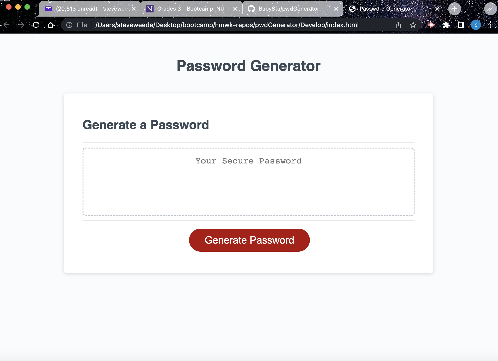

# pwdGenerator

This application will let the user select what type of attributes the password will need, and the length it needs to be. 

https://github.com/BabyStu/pwdGenerator.git

https://babystu.github.io/pwdGenerator/

